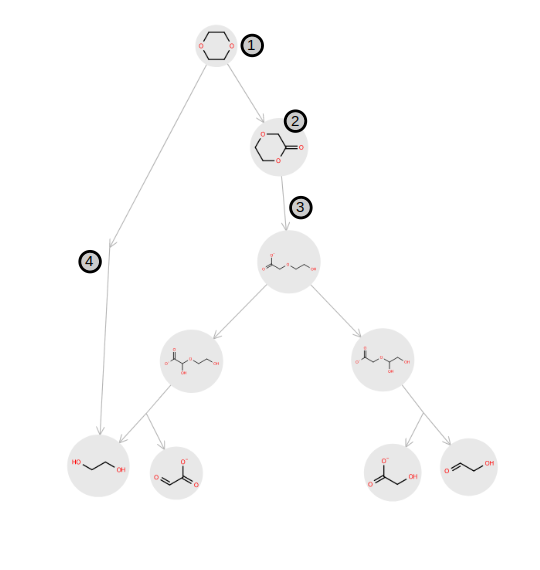

Objects
=======

To use the enviPath-python package, it is helpful to know the main enviPath objects. Some of these objects try to represent
common known chemical entities, such as compounds and reactions. However, they should be understood as a `programatic
way <https://realpython.com/python-classes/>`_ to represent those broadly known entities.

.. currentmodule:: enviPath_python.enviPath

enviPath
--------

The :class:`enviPath` object requires the URL of the instance host in order to be initialized, this information will be then
passed to the subsequently generated objects in order to allow them to retrieve information. This is the
most essential object and it will be used in each of our tutorials. An example of how to initialize this object
is given in the following block of code:

.. code-block:: python

    from enviPath_python import enviPath

    eP = enviPath("https://envipath.org/")

Once this is done you will be able to access any enviPath object by initializing the dedicated class for that
object and passing the ``eP.requester`` and a valid ID (URL) for that specific object. For example, if we want to access
now the `(+)-Camphor` compound from EAWAG-BBD, we can do so as follows:

.. code-block:: python

    from enviPath_python.objects import Compound

    camphor_URL = "https://envipath.org/package/32de3cf4-e3e6-4168-956e-32fa5ddb0ce1/compound/e4fe0464-864c-4cb3-9587-5a82d6dc67fa"
    compound = Compound(eP.requester, id=camphor_URL)

Package
-------
.. seealso::
    A more detailed explanation of Package can be found `here <https://wiki.envipath.com/doku.php?id=packages>`_

.. currentmodule:: enviPath_python.objects

:class:`Package` is one of the most fundamental objects in enviPath. It is the object where collections of other objects, such as
Compounds, Reactions, Pathways, etc. are stored. A package can be public or private, on the first case no login will be
required to access the data, however on the second case it will be necessary to do so. There is a dedicated
:ref:`tutorial<accessing_packages>` to show how to access both types of packages and yet another
:ref:`tutorial<create_package>` to help you see how to create a package and start to add data to it.

Compound
--------
.. seealso::
    A more detailed explanation of Compound can be found `here <https://wiki.envipath.com/doku.php?id=compounds>`_

A :class:`Compound` is an enviPath object within a :ref:`Package` and essentially stores all the molecular information
organized into :ref:`Compound Structure` objects. In other words, a Compound can be thought of as a container of Compound
Structures. A Compound can be
created using a valid `SMILES <https://pubs.acs.org/doi/abs/10.1021/ci00057a005>`_ with the
:meth:`Compound.create` method. After a Compound is created,
the ``smiles`` will be used to create a default Compound Structure.
The default Compound Structure can be
obtained with the :meth:`Compound.get_default_structure` method. This default structure will be accessed when the
:meth:`Compound.get_smiles` is called. Both Compounds and Compound Structures are created automatically with
:ref:`Pathway` prediction (:meth:`Package.predict`) and will be directly associated with a predicted :ref:`Node`.

Compound Structure
------------------

A :class:`CompoundStructure` object can be understood as the object that stores all the molecule related information, i.e. SMILES,
molecular weight, formula, etc. It is associated and stored under a single :ref:`Compound`. The logic behind the
Compound Structure object is to allow several molecules to be stored under the same Compound. For example, one could add
information about the carbon labelled chemical compound that was used to identify a given chemical compound in an experimental set up
or to store different stereoisomers under the same Compound. As in the case of the Compound they can also be created
by passing the SMILES to the :meth:`CompoundStructure.create` method but additionally one should also pass the parent,
i.e. the :ref:`Compound` which will be associated with.

Reaction
--------
.. seealso::
    A more detailed explanation of Reaction can be found `here <https://wiki.envipath.com/doku.php?id=reactions>`_

A :class:`Reaction` is an enviPath object that represents a biotransformation reaction, it connects substrates with
products, each of them represented as a :ref:`Compound Structure`. Usually reactions are
associated as well with a :ref:`Rule`. A user can create a Reaction using the :meth:`Reaction.create` method by specifying
a valid `SMIRKS <https://www.daylight.com/dayhtml/doc/theory/theory.smirks.html>`_ and the package where the Reaction
will be stored. A Reaction can also be created using a list of ``educt`` and ``product`` instead of a SMIRKS.
Additionally, Reaction objects are created automatically with
:ref:`Pathway` prediction and they get directly associated with a predicted :ref:`Edge`.

Rule
----
.. seealso::
    A more detailed explanation of Rule can be found `here <https://wiki.envipath.com/doku.php?id=rules>`_

A :class:`Rule` enviPath object represents a biotransformation rule and are used for the prediction of pathways. They do so by
leveraging SMIRKS Reaction Patterns that identify functional groups and apply the rule whenever the reactant filter pattern
condition is met. Because they are generalization of reactions, they can as well be associated with enzymes that
catalyze the associated reaction and their EC numbers can be retrieved using the
:meth:`Rule.get_ec_numbers` method. On the
enviPath-python implementation of the Rule object, it was decided to represent it as an abstract class, however 3
distinct non-abstract classes inherit from it and can therefore be instantiated. Those are :meth:`SimpleRule`,
:meth:`SequentialCompositeRule` and :meth:`ParallelCompositeRule`.

Pathway
-------
.. seealso::
    A more detailed explanation of Pathway can be found `here <https://wiki.envipath.com/doku.php?id=pathways>`_

A :class:`Pathway` is an enviPath object that represents a biotransformation pathway and stores information of the compounds
and reactions in :ref:`Node` and :ref:`Edge` objects, respectively. Nodes and Edges are concepts derived from
`Graph Theory <https://en.wikipedia.org/wiki/Graph_theory>`_, where
`directed graphs <https://www.geeksforgeeks.org/what-is-directed-graph-directed-graph-meaning/>`_ can be used
to represent biotransformation pathways.
Given that enviPath is a database for biotransformation data, Pathways are one of the most fundamental objects to understand.
Pathways can be generated manually by calling the :meth:`Pathway.create` method, from there
one can add compounds (nodes) and reactions (edges) using the :meth:`Pathway.add_node` and
:meth:`Pathway.add_edge` methods, respectively. Below, we show how the
`1,4-Dioxane <https://envipath.org/package/32de3cf4-e3e6-4168-956e-32fa5ddb0ce1/pathway/19a53ddd-7bbe-43b3-bd56-c1c35302d185>`_
biotransformation pathway looks like in the website:

The image above is a visualization of the information included in a Pathway object. One can have access
to all the compounds (nodes) in the pathway by calling :meth:`Pathway.get_nodes`, analogously one can do the same
for reactions (edges) with :meth:`Pathway.get_edges`.

Pathways can also be predicted by invoking the method
:meth:`Package.predict`, which will use the provided
setting to extract the :ref:`Relative Reasoning` model and use it to predict new compounds based on the
set of rules that it has been trained on.

Node
~~~~

The :class:`Node` enviPath object represents a :ref:`Compound Structure` on a :ref:`Pathway`. In the previous image, both
compounds labelled 1 and 2 are examples of nodes. The difference between them is that 1 does not have an incoming edge and
for this reason, node 1 is named the `root node`. Nodes also store the property ``depth``, this is a feature that informs
the depth of the node on the pathway. Hence, the root node have a defined ``depth=0`` and the node labelled
as 2 on the image would have a ``depth=1``. This attribute is useful to navigate through the pathway and can be accessed
with the method :meth:`Node.get_depth`

Edge
~~~~

The :class:`Edge` enviPath object represents a :ref:`Reaction` on a :ref:`Pathway` and can be accessed through the
:meth:`Edge.get_reaction` method. In the previous image, edges labelled as 3 and 4 are examples of pathway edges. The
difference between them is that edge 3 represents a `Simple Reaction` while 4 represents a `Multistep Reaction`. On
enviPath we visualize a reaction as Multistep Reaction when we want to indicate that a compound got mineralized or
when the intermediates of a reaction are unknown.
Additionally, its corresponding substrates and products can be accessed using :meth:`Edge.get_start_nodes` and
:meth:`Edge.get_end_nodes` methods, respectively.

Relative Reasoning
------------------
.. seealso::
    A more detailed explanation of Relative Reasoning can be found `here <https://wiki.envipath.com/doku.php?id=relative_reasoning>`_

A :class:`RelativeReasoning` enviPath object can be understood as the model that is used to generate pathway predictions. This
is a relevant object for users wanting to generate predictions using the models stored in our database.
This can be achieved with the method :meth:`RelativeReasoning.classify_smiles`, given that a valid SMILES is provided.
This method will return a list with of expected products without storing them on the database, leading to reduced
computation time.

Scenario
--------
.. seealso::
    A more detailed explanation of Scenario can be found `here <https://wiki.envipath.com/doku.php?id=scenarios>`_

A :class:`Scenario` enviPath object represents the experimental conditions that were used for a given biotransformation pathway.
Ideally it links to a reference article where the given experiment is thoroughly described. A Scenario can be attached
to **any** other enviPath object. On many papers, different experimental conditions are tested but some parameters are
shared across them. In order to ease inputting those types of scenarios, the concept of `Related Scenario` was developed.
A Related Scenario is a Scenario that points to another Scenario from which data will be copied. This can be seen in
more detail on the :ref:`Creating packages<create_package>` tutorial.

Additional Information
~~~~~~~~~~~~~~~~~~~~~~

:class:`AdditionalInformation` objects store a experimental condition, there are numerous classes that inherit from
Additional Information, to mention some
:class:`AcidityAdditionalInformation` or :class:`HalfLifeAdditionalInformation`.
This :ref:`tutorial<download_additional_information_data>` shows how one can access the information contained in
:ref:`Scenario` to retrieve experimental data.